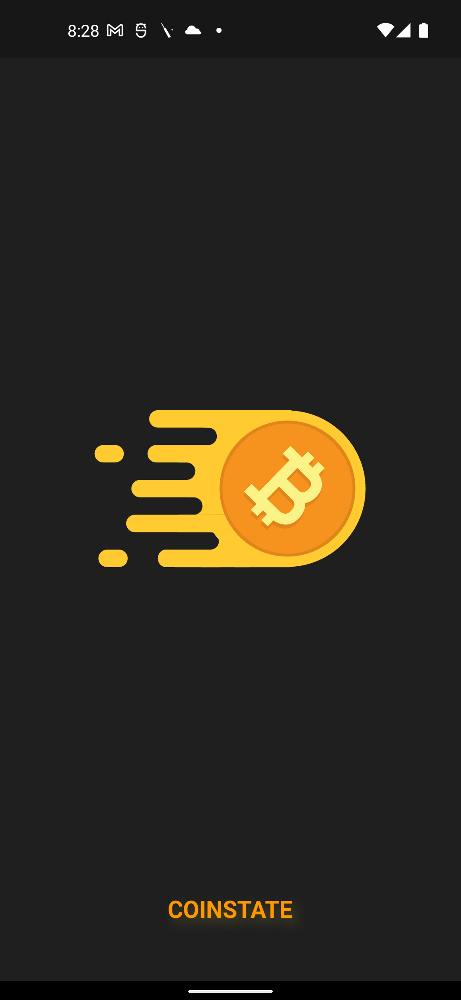
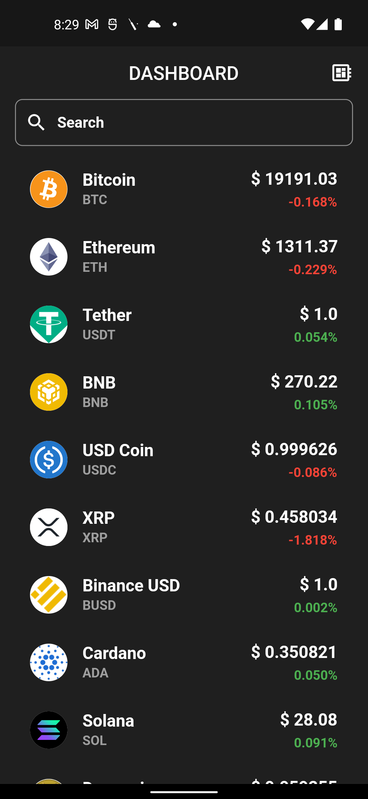
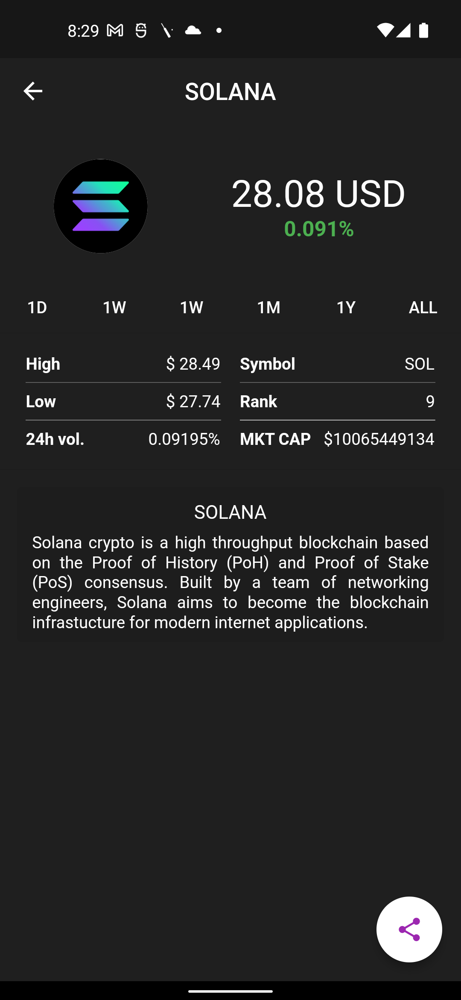
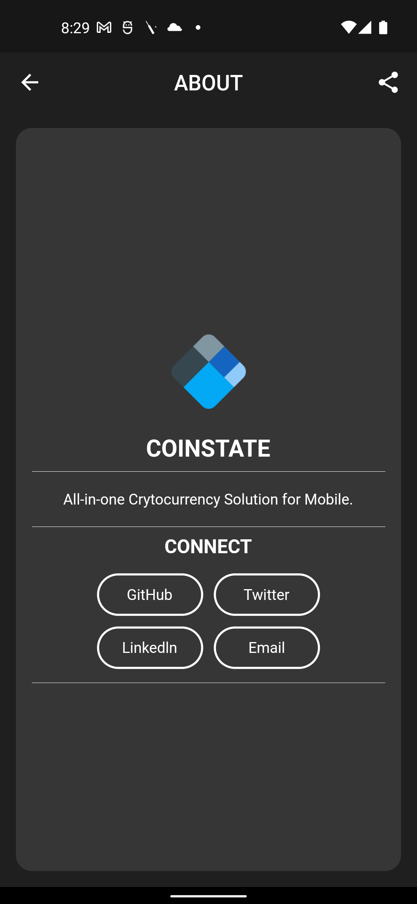

# Coinstate

> Cyptocurrency Price Tracker for mobile platform.

<p align="center">
  
</p>

<p align="center"><a href="https://github.com/subrotokumar/cryptobook/releases">  </a>
<br>
<a href="https://github.com/subrotokumar/cryptobook" alt="GitHub release"></a>
</p>


## Screenshot 
<p align="center">
&nbsp;&nbsp;
&nbsp;&nbsp;
&nbsp;&nbsp;

</p>

## Features

- Clean and Modern UI.
- Live price previews.
- Share price info via Platform sharing menu.
- 

## Tech Stack

**Language:** Dart  
**Framework:** Flutter  
**Dependencies:** :  
  http&nbsp;- flutter_svg&nbsp; - provider&nbsp;- share_plus&nbsp;- cached_network_image&nbsp;- screenshot  
  lottie&nbsp;- flutter_launcher_icons&nbsp;- flutter_html&nbsp;-path_provider&nbsp;- url_launcher


## Run Locally

Clone the project

```bash
  git clone https://github.com/subrotokumar/cryptobook.git
  cd cryptobook
  flutter pub get
  flutter run
```

## Contribution
Your ideas, translations, design changes, code cleaning, or real heavy code changes or any help is always welcome. The more is contribution the better it gets

[Pull requests](https://github.com/cryptobook/pulls) will be reviewed
<!--
#### Known issues and limitations
-->
